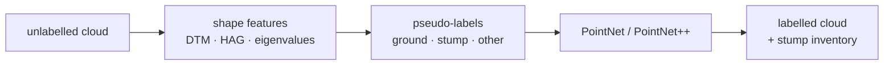

# JungleLook

**Label-free segmentation of forest point clouds: geometric features → pseudo-labels → PointNet / PointNet++.**

[](https://github.com/ItsShriks/JungleLook/actions/workflows/ci.yml)


Reforestation teams survey clear-cuts with UAVs and need to know where the ground, the tree
stumps and the remaining vegetation are. Those point clouds arrive **unlabelled**, and hand-labelling
millions of points per site doesn't scale. **JungleLook** turns a raw cloud into a labelled cloud and a
**stump inventory** (position, height, diameter) without any manual annotation:



## Highlights

- **No annotation needed.** It uses a progressive morphological ground filter, multi-scale eigenvalue features, a
  vertical-continuity feature that separates stumps from trunk bases, and DBSCAN with shape tests. Every
  rule decision is written out and can be inspected.
- **Both architectures from scratch in pure PyTorch.** PointNet (T-Nets plus orthogonality regulariser) and
  PointNet++ (farthest-point sampling, ball query, feature propagation) run on CPU, CUDA and Apple MPS
  with no CUDA extensions.
- **Honest evaluation.** It uses spatial tile splits, sliding-window voting at inference, and point- *and* object-level
  metrics. Pseudo-labels are scored against real annotations, not only against themselves.
- **Annotation registration.** Stump polygons drawn on a UTM orthophoto are aligned to a LiDAR SLAM map with no
  control points, using RANSAC and ICP. **98.8 % of annotation points land within 0.3 m (RMS 0.11 m).**
- **Built to be used.** One CLI, YAML configs with `--set` overrides, LAS/LAZ/PLY/PCD/ASCII I/O,
  self-describing checkpoints, CI, Docker, and tests on synthetic forests with known ground truth.

## Try it in two commands

```bash
pip install -e ".[las,dev]"
```
```bash
junglelook demo
```

`junglelook demo` generates two synthetic forest plots with ground, stumps, shrubs and trees. It trains on
plot A with **no labels** and segments plot B, which it never saw. It then scores the result against the true labels
and writes figures to `work/demo/`:

| file | content |
|---|---|
| `plot_a_pseudolabels.png` | what the geometric rules produced for training |
| `plot_b_prediction.png` / `plot_b_truth.png` | model output vs. ground truth on the unseen plot, with detected stumps circled |
| `demo_summary.json` | mIoU, per-class IoU and stump detection precision / recall |

## Use it on your own data

```bash
cp configs/template.yaml configs/my_site.yaml
```
```bash
junglelook run -c configs/my_site.yaml
```
```bash
junglelook predict --checkpoint work/my_site/runs/<run>/best.pt --input new_area.laz --output new_area.ply
```

`predict` writes the labels and class probabilities as scalar fields (open them in CloudCompare) and
`new_area_instances.csv` with one row per stump. Run `junglelook --help` for all commands: `extract`,
`pseudolabel`, `split`, `train`, `evaluate`, `predict`, `render`, `register`, `demo`.

## Results on real data (Field-D, UAV LiDAR)

| | |
|---|---|
| Annotation → LiDAR registration | 98.8 % inliers, RMS 0.11 m |
| Ground model vs. CloudCompare CSF | 99 % / 99 % class separation at CSF's 0.5 m threshold |
| PointNet++ trained on pseudo-labels, validation mIoU (preliminary) | **0.80** (ground 0.99 · other 0.95 · stump 0.46) |
| Rule-based stump detection vs. 129 annotated stumps | F1 0.31 |

Stump detection on this dataset is limited by the data, and the limit can be measured. The LiDAR ground layer is
~26 cm thick and the stumps rise only 20–40 cm, with about 15–20 points each. See
[docs/results.md](docs/results.md) for the analysis and [docs/method.md](docs/method.md) for the details.

## Repository

```
junglelook/        package: io · features · pseudolabel · register · data · models · train · infer · render · demo
configs/          field_d.yaml (real site) · template.yaml (new site) · transforms/
tests/            synthetic forests with known labels: unit + end-to-end tests
docs/             method · results · retrospective (v1 prototype → v2 pipeline)
```

The Field-D data is not included in the repository. With the data placed in `dataset/`, run
`make field-d` to reproduce the real-data results.

## Background

This grew out of an R&D project at Hochschule Bonn-Rhein-Sieg with Garrulus on terrain and stump
segmentation of UAV scans. The first prototype was rebuilt into this pipeline;
[docs/retrospective.md](docs/retrospective.md) covers what changed and why.
