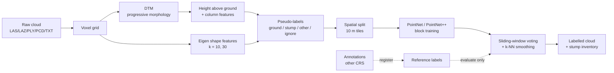

# Method

## 1. Features (`junglelook/features.py`)

All features are computed without labels and are invariant to rotation about the vertical axis,
so z-rotation augmentation stays consistent with them.

| feature | meaning |
|---|---|
| `hag` | height above ground |
| `column_max_hag` | tallest point in the 0.5 m XY column |
| `column_stack_hag` | top of the gap-free stack of points rising from the ground (gaps > 0.4 m end it) |
| `column_rel_height` | `hag / column_max_hag` |
| `linearity` `planarity` `scattering` | (λ1-λ2)/λ1, (λ2-λ3)/λ1, λ3/λ1 of the k-NN covariance |
| `curvature` | λ3 / (λ1+λ2+λ3) |
| `verticality` `normal_z` | 1-\|n_z\|, \|n_z\| |
| `roughness` | distance to the local plane |
| `density` | log(k / volume of the k-NN sphere) |

**Ground model.** This is a progressive morphological filter (Zhang et al., 2003) on a 0.5 m min-z raster.
1. Single-cell pits (low noise) are closed first.
2. The surface is grey-opened with 1, 2 and 4 m windows. A cell that drops by more than
   `dh0 + slope·Δw` is marked non-ground. Small windows remove stumps and larger ones remove shrubs and logs,
   while the slope term keeps real relief.
3. Non-ground cells are refilled from the nearest ground cell, then smoothed.
4. Height above ground (HAG) is interpolated bilinearly.

**Vertical stack.** A stump under a tree crown and the base of a trunk look alike at 30 cm. The
difference is that the trunk's points continue upwards without a gap. `column_stack_hag` captures
that, and it raised stump recall on the synthetic plots from 76 % to 96 %.

## 2. Pseudo-labels (`junglelook/pseudolabel.py`)

| class | rule |
|---|---|
| ground | `hag < 0.12 m` |
| ignore | `0.12 ≤ hag < 0.20 m`. The least reliable band is excluded from the loss |
| stump | DBSCAN (ε 8 cm) over points with 0.05 < hag < 1.5 m and a vertical stack ending below 1 m; each cluster must have ≥ 80 points, height 0.12–0.8 m, diameter 0.3–2.5 m, roundness √(λ2/λ1) ≥ 0.3, height/diameter ≤ 4, mean scattering ≤ 0.25 |
| other | remaining off-ground points |

Every candidate cluster and its measurements go to `stump_candidates.csv`, so every rejection can be explained.

## 3. Learning (`junglelook/data.py`, `junglelook/models/`, `junglelook/train.py`)

* **Spatial split.** Whole 10 × 10 m tiles go to train (70 %), val (15 %) or test (15 %). Neighbouring points are
  near-duplicates, so a point-level split would leak.
* **Blocks.** Training uses 6 × 6 m blocks of 4096 points. Block centres are sampled class-balanced so the rare stump
  class is seen often. Augmentation is z-rotation, mirroring, 0.9–1.1 scaling and 1 cm jitter.
  The input is block-local xyz in metres plus the standardised features.
* **PointNet.** Input and feature T-Nets, a 1024-d global max-pooled feature concatenated to each point, and the
  ‖I − AAᵀ‖ regulariser.
* **PointNet++ (SSG).** Four set-abstraction levels (1024/256/64/16 centroids, radii 0.2/0.4/0.8/1.6 m) and four
  feature-propagation levels. It is written in pure PyTorch (farthest-point sampling, ball query and 3-NN
  interpolation included), so it runs on CPU, CUDA and Apple MPS.
* **Optimisation.** Weighted cross-entropy (ENet weights 1/ln(1.02 + f), ignore = −1), AdamW with warm-up and a cosine
  schedule, gradient clipping, AMP on CUDA, and early stopping on validation mIoU.

## 4. Inference (`junglelook/infer.py`)

Sliding 6 m windows with a 3 m stride cover every point about four times, and the softmax outputs are averaged. The
probabilities are then smoothed over 8 nearest neighbours, and predicted stump points are clustered with DBSCAN into
instances. Each instance gets a position, ground elevation, height, diameter and roundness in `*_instances.csv`.

## 5. Registering annotations (`junglelook/register.py`)

Annotations drawn on a geo-referenced orthophoto (UTM) and a LiDAR SLAM map (local frame) share no control points.
`register` solves this in four steps:

1. RANSAC over pairs of annotation centroids and pairs of stump-like clusters with the same separation gives a
   rotation about z and an XY shift.
2. The vertical offset is the median z difference under the annotations.
3. Point-to-point ICP refines the full 3D rigid transform.
4. The result is written as a 4 × 4 matrix used by `reference.sources[].transform`.

## 6. Evaluation

* **Point level.** OA, mean accuracy, mIoU and per-class IoU / precision / recall / F1, against the pseudo-labels
  (agreement) and against the reference (truth).
* **Object level.** A reference stump is found when a predicted instance centre lies within 0.75 m of it, with
  one-to-one greedy matching.
